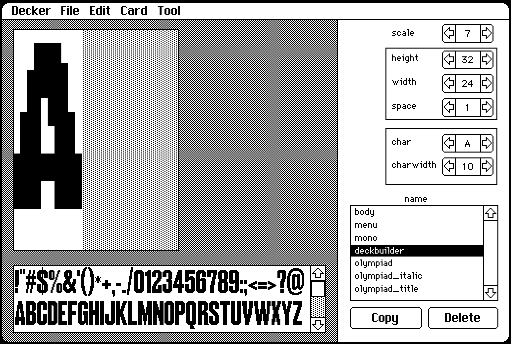

# Awesome Decker

[Decker](https://beyondloom.com/decker/index.html) is an interactive media platform in the spirit of HyperCard.

This is a collection of awesome Decker projects (decks) and related reasources. Create an issue to add a link.

## Official Resouces
- [Decker Tour (deck)](https://beyondloom.com/decker/tour.html)
- [Reference Manual](https://beyondloom.com/decker/decker.html)
- [Mac OS and Windows Binaries](https://internet-janitor.itch.io/decker)

## Example Decks
The following Decks are [Example Decks](https://github.com/JohnEarnest/Decker/tree/main/examples/decks) from the Decker repository by [John Earnest](https://github.com/JohnEarnest)

### Chickenwave
Dancing chicken

### Cylon
Talking robot

### Draggable
Tutorial of draggable canvas (also contains "rect" module)

### Fontedit
Font editor

### Graphpad
A graph paper deck with isometric, square and triange grids

### Guis
A [7 guis](https://7guis.github.io/7guis/) implementation in Decker

### Life
[Conway's Game of Life](https://en.wikipedia.org/wiki/Conway%27s_Game_of_Life)

### Plot
Graphing module demo and documentation

### Publictransit
A collection of card transitions

### Transit
Card transition editor

## Games
- [Flappybird](https://github.com/razetime/decks) by [razetime](https://github.com/razetime) 
## Fonts
- [Fonts Collection](https://github.com/1jss/decker-fonts)
- [Monospace Fonts](https://github.com/ktye/i/blob/master/_/i2/kui/f/fonts.deck) by [ktye](https://github.com/ktye)

## Installation
- [Installing on Linux](https://github.com/1jss/decker-linux)
