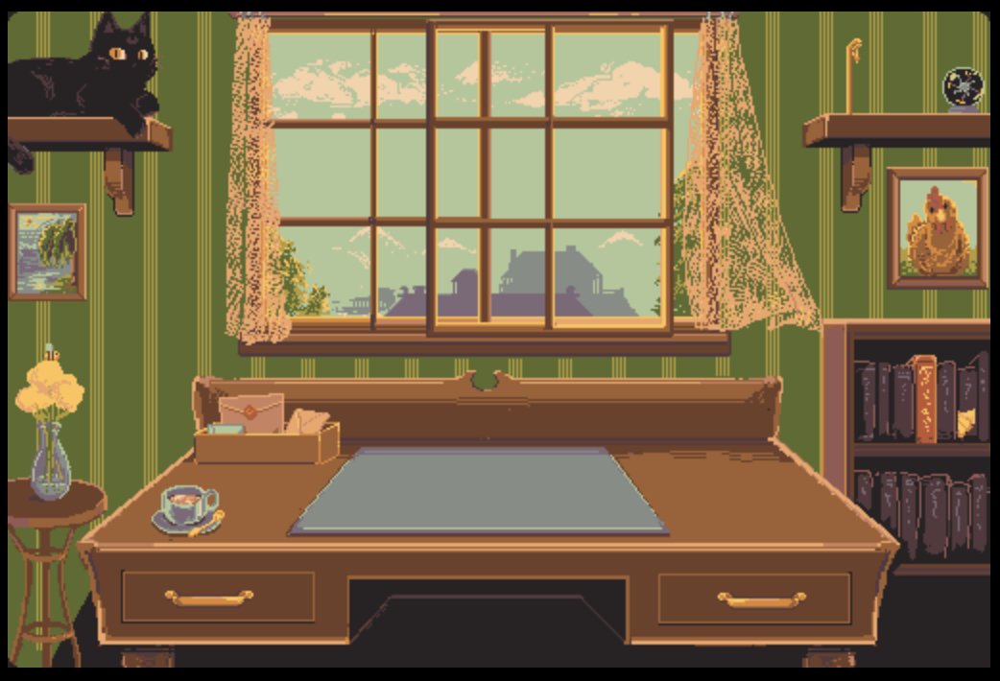

# Awesome Decker

[Decker](https://beyondloom.com/decker/index.html) is an interactive media platform in the spirit of HyperCard.

This is a collection of awesome Decker projects (decks) and related reasources. Create an issue to add a link.

## Official Resouces
- [Decker Tour (deck)](https://beyondloom.com/decker/tour.html)
- [Reference Manual](https://beyondloom.com/decker/decker.html)
- [Mac OS and Windows Binaries](https://internet-janitor.itch.io/decker)

## Example Decks
The following Decks are [Example Decks](https://github.com/JohnEarnest/Decker/tree/main/examples/decks) from the Decker repository by [John Earnest](https://github.com/JohnEarnest)

### Brushes
Collection of extra brushes for drawing

### Chip8
Chip8 interpreter inside Decker

### Cylon
Talking robot

### Dialog
Dialog library for popup dialogs

### Draggable
Tutorial of draggable canvas (also contains "rect" module)

### Ease
Easing functions

### Fontedit
Font editor (import fonts into other decks by drag and drop)

### Graphpad
A graph paper deck with isometric, square and triange grids

### Guis
A [7 guis](https://7guis.github.io/7guis/) implementation in Decker

### Life
[Conway's Game of Life](https://en.wikipedia.org/wiki/Conway%27s_Game_of_Life)

### Ovum
Decorate your egg

### Patedit
Decker pattern editor

### Plot
Graphing module demo and documentation

### Publictransit
A collection of card transitions

### Sound
Sound demonstration deck

### Transit
Card transition editor

## Click arounds

### [Desker](https://crowmorbid.itch.io/desker-deckmonth) by [crowmorbid](https://crowmorbid.itch.io/)

## Tools
### [Budget](https://robocop.itch.io/budget-deck) by [robocop](https://robocop.itch.io/)

### [Wigglypaint](https://internet-janitor.itch.io/wigglypaint) by [internet-janitor](https://internet-janitor.itch.io/)
Paint with wiggly lines

### JankyTunes by [Millie Squilly](https://micpp.itch.io/)

This is a trio of wonderful instruments written and played in Decker.

[Janky Synthesizer](https://micpp.itch.io/janky-synthesizer)

[Janky Drum Machine](https://micpp.itch.io/janky-drum-machine)

[Janky Sequencer](https://micpp.itch.io/janky-sequencer)

The sequencer can also be embedded in other decks via the [JunkyTunes Contraption](https://micpp.itch.io/jankytunes-the-contraption)

## Games

### [Loco Card](https://zunil.itch.io/loco-card) by [zanul](https://zunil.itch.io)

### [Low Odds](https://sysl.itch.io/low-odds-pretend-scratch-card-game) by [sysl](https://sysl.itch.io/)

### [Flappybird](https://github.com/razetime/decks) by [razetime](https://github.com/razetime) 

## Zines

### [Felix Writes](https://felix.plesoianu.ro/sci-fi/zine.html) by [felixp7](https://github.com/felixp7)

## More Decks
- [Decktember](https://itch.io/jam/decktember/entries)
- [Decker Fantasy Camp 2023](https://itch.io/jam/decker-fantasy-camp-2023/entries)
- [Deck-Month](https://itch.io/jam/deck-month/entries)

## Contraptions

Contraptions are small snippets or windgets that can be imported and used in other decks. They often solve a specific problem such as creating patterns or animating an element in a certain way.

Many usefull contraptions can be found in the [Contraption Bazaar](https://itch.io/t/2690007/the-contraption-bazaar) where the following (and more) contraptions can be found:
- The "marquee" contraption
- The "flag" contraption
- The "patternPicker" contraption
- The "DVD ScreenSaver" contraption
- The Bouncer Contraption
- The "macWindow" contraption
- The EggTimer Contraption
- The eye contraption
- The "bob" Contraption
- The "gif" Contraption
- The "scrubber" Contraption
- The "enum" Contraption
- The imageEnum Contraption
- Validator Contraption
- The .Beat Contraption
- The Pulse Contraption
- The Turtle Contraption
- JankyTunes: The Contraption
- The SearchEngine Contraption
- The PatEdit Contraption
- The PalImport Contraption
- The AnimEdit Contraption
- The Rotor Contraption
- The SeekRotor Contraption
- The BitField Contraption
- The Interior Contraption
- The PopOut Contraption

## Fonts
- [Fonts Collection](https://github.com/1jss/decker-fonts)
- [Monospace Fonts](https://github.com/ktye/i/blob/master/_/i2/kui/f/fonts.deck) by [ktye](https://github.com/ktye)